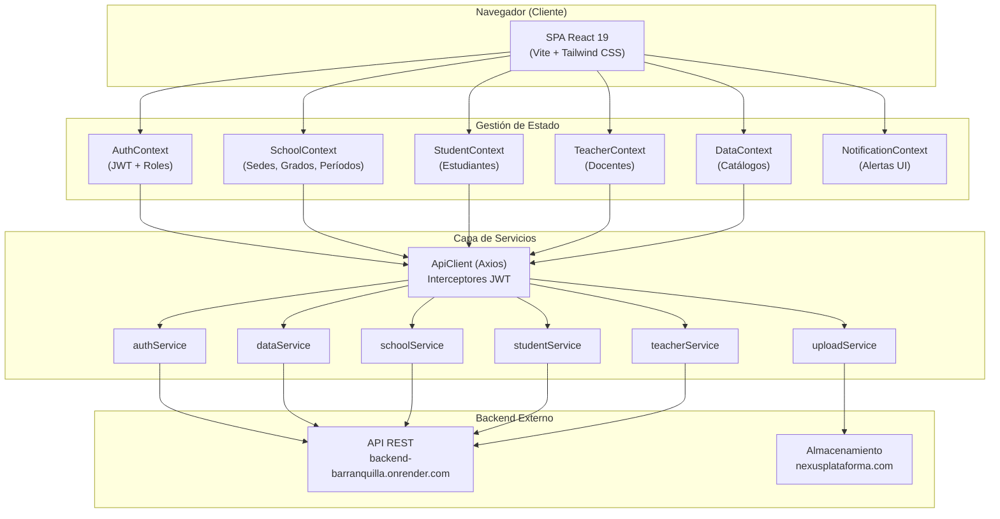
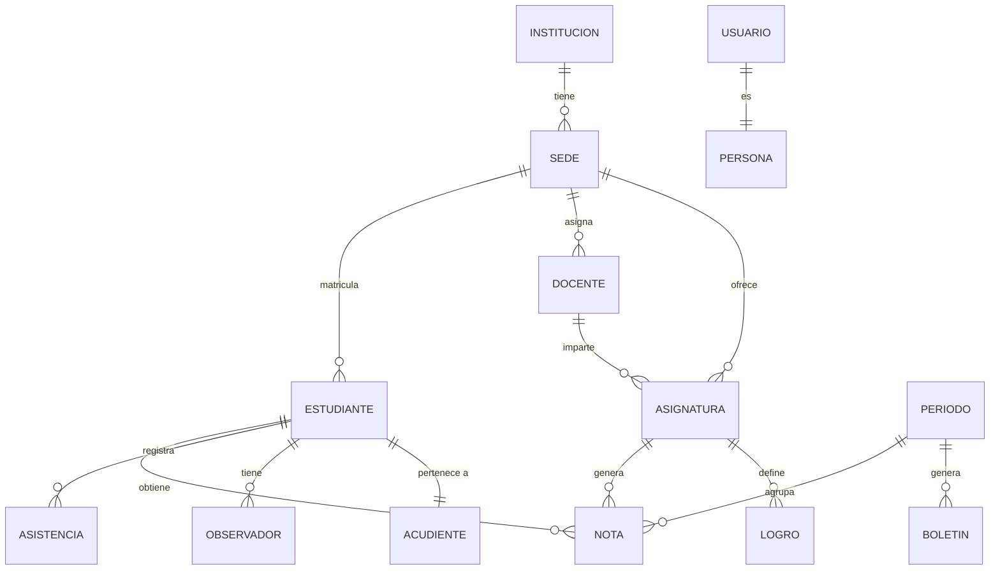

# Nexus — Sistema de Gestión Educativa

> Plataforma web integral para la administración y gestión institucional de centros educativos. Permite gestionar estudiantes, docentes, asignaturas, calificaciones, asistencia, boletines y reportes académicos desde una única interfaz unificada.

---

## Tabla de Contenidos

1. [Descripción General](#1-descripción-general)
2. [Arquitectura](#2-arquitectura)
3. [Tecnologías Utilizadas](#3-tecnologías-utilizadas)
4. [Requisitos Previos](#4-requisitos-previos)
5. [Instalación](#5-instalación)
6. [Ejecución del Proyecto](#6-ejecución-del-proyecto)
7. [Estructura del Repositorio](#7-estructura-del-repositorio)
8. [Servicios API / Endpoints](#8-servicios-api--endpoints)
9. [Base de Datos](#9-base-de-datos)
10. [Pruebas](#10-pruebas)
11. [Despliegue](#11-despliegue)
12. [Buenas Prácticas y Convenciones](#12-buenas-prácticas-y-convenciones)
13. [Problemas Conocidos / Limitaciones](#13-problemas-conocidos--limitaciones)
14. [Roadmap](#14-roadmap)
15. [Licencia](#15-licencia)
16. [Vistas y Funcionalidades del Sistema](#16-vistas-y-funcionalidades-del-sistema)

---

## 1. Descripción General

### Propósito del sistema

Nexus es una aplicación web de tipo SPA (_Single Page Application_) orientada a instituciones educativas. Su propósito es centralizar y digitalizar los procesos administrativos y académicos: registro de estudiantes y docentes, control de asistencia, gestión de calificaciones, generación de boletines, observador del estudiante y seguimiento de alertas institucionales.

### Problema que resuelve

Las instituciones educativas frecuentemente gestionan sus procesos en sistemas fragmentados (planillas físicas, hojas de cálculo, correo electrónico), lo que genera inconsistencias en la información, pérdida de datos y dificultad para reportar a entes regulatorios. Nexus centraliza estos procesos en un único sistema con control de acceso por roles.

### Alcance

- Gestión de múltiples instituciones con soporte para múltiples sedes (_multi-sede_).
- Administración de estudiantes: registro, matrícula, seguimiento académico y disciplinario.
- Administración de docentes: asignación de materias, registro de asistencia y notas.
- Generación de documentos académicos: boletines, carnés e informes en PDF.
- Carga masiva de datos mediante archivos Excel.
- Auditoría de acciones del sistema.
- Sistema de notificaciones en tiempo real dentro de la aplicación.
- Tours interactivos de onboarding por funcionalidad.
- Personalización visual (colores institucionales) por organización.

---

## 2. Arquitectura

### Descripción de alto nivel

Nexus es una SPA desacoplada del backend. El frontend se comunica con una API REST externa mediante HTTP/HTTPS. El estado global de la aplicación se gestiona con Context API de React. La autenticación usa tokens JWT almacenados en `localStorage`.

### Componentes principales

| Componente              | Responsabilidad                                   |
| ----------------------- | ------------------------------------------------- |
| **SPA React**           | Interfaz de usuario, enrutamiento, estado global  |
| **API REST externa**    | Lógica de negocio, persistencia de datos          |
| **Vercel**              | Hosting estático y reescritura de rutas SPA       |
| **nexusplataforma.com** | Almacenamiento de archivos (imágenes, documentos) |

### Diagrama de arquitectura



---

## 3. Tecnologías Utilizadas

### Lenguajes y entorno

| Categoría            | Tecnología       | Versión |
| -------------------- | ---------------- | ------- |
| Lenguaje             | JavaScript (JSX) | ES2020+ |
| Entorno de ejecución | Node.js          | ≥ 18    |

### Frameworks y librerías principales

| Categoría               | Librería                    | Versión            |
| ----------------------- | --------------------------- | ------------------ |
| Framework UI            | React                       | ^19.2.3            |
| Enrutamiento            | React Router DOM            | ^7.9.5             |
| Estilos                 | Tailwind CSS                | ^4.1.16            |
| Cliente HTTP            | Axios                       | ^1.13.1            |
| Tablas avanzadas        | TanStack React Table        | ^8.21.3            |
| Gráficas y dashboards   | Recharts                    | ^3.3.0             |
| Generación de PDF       | jsPDF + @react-pdf/renderer | ^3.0.3 / ^4.3.0    |
| Visualización de PDF    | react-pdf + pdfjs-dist      | ^10.2.0 / ^5.4.394 |
| Exportación de pantalla | html2canvas                 | ^1.4.1             |
| Archivos Excel          | xlsx                        | ^0.18.5            |
| Criptografía            | js-sha256                   | ^0.11.1            |
| Iconografía             | Lucide React                | ^0.548.0           |
| Tours guiados           | Driver.js                   | ^1.4.0             |
| Webcam                  | react-webcam                | ^7.2.0             |
| Firma digital           | react-signature-canvas      | ^1.1.0-alpha.2     |

### Herramientas de desarrollo

| Herramienta       | Versión                     |
| ----------------- | --------------------------- |
| Build tool        | Vite (Rolldown) 7.1.14      |
| Linter            | ESLint ^9.36.0              |
| Plugin React Vite | @vitejs/plugin-react ^5.0.4 |

---

## 4. Requisitos Previos

| Software          | Versión mínima                         | Notas                               |
| ----------------- | -------------------------------------- | ----------------------------------- |
| Node.js           | 18.x LTS                               | Se recomienda la última versión LTS |
| npm               | 9.x                                    | Incluido con Node.js                |
| Git               | 2.x                                    | Para clonar el repositorio          |
| Navegador moderno | Chrome 110+ / Firefox 110+ / Edge 110+ | Con soporte de ES2020               |

> **Acceso al backend:** Es necesario tener las credenciales y la URL de la API REST. La URL por defecto apunta a `https://backend-barranquilla.onrender.com`.

---

## 5. Instalación

### 1. Clonar el repositorio

```bash
git clone <URL_DEL_REPOSITORIO>
cd ProjectB
```

### 2. Instalar dependencias

```bash
npm install
```

### 3. Configurar variables de entorno

Crear un archivo `.env` en la raíz del proyecto con el siguiente contenido:

```env
# URL base de la API REST del backend
VITE_API_URL=https://backend-barranquilla.onrender.com
```

> **Nota:** Si la variable `VITE_API_URL` no se define, el cliente Axios usará la URL de producción por defecto. Todas las variables deben incluir el prefijo `VITE_` para ser accesibles desde el frontend (convención de Vite).

---

## 6. Ejecución del Proyecto

### Scripts disponibles

| Script       | Comando           | Descripción                                                                                  |
| ------------ | ----------------- | -------------------------------------------------------------------------------------------- |
| Desarrollo   | `npm run dev`     | Inicia el servidor de desarrollo en `http://localhost:5173` con HMR (Hot Module Replacement) |
| Compilación  | `npm run build`   | Genera la compilación optimizada para producción en `/dist`                                  |
| Vista previa | `npm run preview` | Sirve localmente la compilación de producción para validación final                          |
| Linting      | `npm run lint`    | Ejecuta ESLint sobre todo el proyecto                                                        |

### Entornos

| Entorno                 | Comando                            | Descripción                                                   |
| ----------------------- | ---------------------------------- | ------------------------------------------------------------- |
| **Desarrollo**          | `npm run dev`                      | Variables `.env`, recarga automática, source maps habilitados |
| **Producción (local)**  | `npm run build && npm run preview` | Compilación optimizada, sin source maps                       |
| **Producción (Vercel)** | Automático (CI/CD)                 | Desplegado al hacer `push` o `merge` en la rama principal     |

---

## 7. Estructura del Repositorio

```
ProjectB/
├── public/                     # Activos estáticos servidos sin procesamiento
├── src/
│   ├── main.jsx                # Punto de entrada: monta la app y envuelve providers
│   ├── assets/                 # Imágenes, íconos y archivos de licencia
│   ├── components/
│   │   ├── atoms/              # Componentes atómicos reutilizables (14 componentes)
│   │   ├── molecules/          # Componentes compuestos (43 componentes)
│   │   └── templates/          # Layouts de página (DashboardTemplate, ReserveSpot)
│   ├── lib/
│   │   ├── context/            # Proveedores de estado global (6 contextos React)
│   │   ├── hooks/              # Hooks personalizados que consumen los contextos
│   │   └── constants/          # Constantes globales de la aplicación
│   ├── pages/
│   │   ├── App.jsx             # Componente raíz, define el árbol de rutas
│   │   ├── Dashboard/          # Vistas de panel principal y administración
│   │   ├── Login/              # Autenticación y recuperación de contraseña
│   │   ├── Student/            # Gestión integral de estudiantes (13 vistas)
│   │   ├── Teacher/            # Gestión integral de docentes (9 vistas)
│   │   ├── School/             # Gestión institucional (8 vistas)
│   │   └── GradeRecords/       # Registros académicos (2 vistas)
│   ├── routes/
│   │   └── generalRoutes.jsx   # Definición centralizada de todas las rutas
│   ├── services/
│   │   ├── ApiClient.js        # Instancia Axios con interceptores JWT y validación
│   │   ├── authService.js      # Endpoints de autenticación
│   │   ├── dataService.js      # Datos maestros y catálogos
│   │   ├── schoolService.js    # Gestión de instituciones y sedes
│   │   ├── studentService.js   # Gestión de estudiantes
│   │   ├── teacherService.js   # Gestión de docentes
│   │   ├── uploadService.js    # Carga de archivos multimedia
│   │   └── DataExamples/       # Datos mock para desarrollo local
│   ├── styles/
│   │   └── globals.css         # Estilos globales y variables CSS personalizadas
│   ├── tour/                   # Archivos de configuración para tours guiados (Driver.js)
│   └── utils/
│       ├── cssUtils.js         # Utilidades de estilos dinámicos
│       ├── downloadUtils.js    # Descarga de archivos y documentos
│       ├── exportPdf.js        # Exportación a PDF e imagen
│       ├── formatUtils.js      # Formato de fechas, números y validaciones básicas
│       ├── teacherUtils.js     # Transformaciones de datos de docentes
│       ├── themeManager.js     # Gestión de temas y colores institucionales
│       └── validationUtils.js  # Reglas de validación de formularios
├── eslint.config.js            # Configuración de ESLint
├── index.html                  # HTML raíz de la SPA
├── package.json                # Dependencias y scripts del proyecto
├── vite.config.js              # Configuración de Vite (proxy, plugins)
└── vercel.json                 # Configuración de despliegue en Vercel
```

### Descripción de directorios clave

| Directorio                  | Responsabilidad                                                                                                                                     |
| --------------------------- | --------------------------------------------------------------------------------------------------------------------------------------------------- |
| `src/lib/context/`          | Estado global de la aplicación. Contiene `AuthContext`, `DataContext`, `SchoolContext`, `StudentContext`, `TeacherContext` y `NotificationContext`. |
| `src/lib/hooks/`            | Hooks de acceso simplificado a cada contexto (`useAuth`, `useData`, `useSchool`, `useStudent`, `useTeacher`, `useNotify`).                          |
| `src/services/`             | Capa de abstracción sobre la API REST. Cada archivo encapsula los endpoints de un dominio.                                                          |
| `src/components/atoms/`     | Componentes primitivos sin lógica de negocio: botones, selectores, modales, loaders, etc.                                                           |
| `src/components/molecules/` | Componentes que combinan átomos con lógica de presentación: tablas con acciones, formularios de selección, paneles de perfil.                       |
| `src/tour/`                 | Configuraciones de tours paso a paso usando Driver.js. Un archivo por funcionalidad del sistema.                                                    |

---

## 8. Servicios API / Endpoints

La comunicación con el backend se realiza a través de `ApiClient.js`, que configura una instancia de Axios con:

- **Base URL:** `VITE_API_URL` (por defecto `https://backend-barranquilla.onrender.com`)
- **Interceptor de solicitud:** Agrega automáticamente el encabezado `Authorization: Bearer <token>`.
- **Interceptor de respuesta:** Valida que `response.data.code === "OK"`. Si la respuesta es un error de autenticación (401/403), desautentica al usuario automáticamente.

### authService — Autenticación

| Método | Endpoint                  | Descripción                                    |
| ------ | ------------------------- | ---------------------------------------------- |
| `POST` | `/auth/login`             | Autenticación con email y contraseña (SHA-256) |
| `POST` | `/auth/forgot-password`   | Solicitud de recuperación de contraseña        |
| `POST` | `/recoverypassword`       | Cambio de contraseña con token de recuperación |
| `POST` | `/slots`                  | Reserva de cupos (pública, sin autenticación)  |
| `POST` | `/uploadfirma/acudientes` | Registro de firma digital de acudientes        |

### dataService — Datos maestros

| Método | Endpoint                | Descripción                         |
| ------ | ----------------------- | ----------------------------------- |
| `GET`  | `/identification-types` | Tipos de identificación disponibles |
| `GET`  | `/scholarships/status`  | Estados de beca                     |
| `GET`  | `/roles`                | Roles del sistema                   |
| `POST` | `/menus/:roleId`        | Menú dinámico según rol del usuario |
| `GET`  | `/departments`          | Lista de departamentos              |
| `GET`  | `/cities/:id`           | Ciudades por departamento           |
| `POST` | `/users`                | Registro de nuevos usuarios         |

### schoolService — Gestión escolar

| Método  | Endpoint                   | Descripción             |
| ------- | -------------------------- | ----------------------- |
| `GET`   | `/institution`             | Obtener instituciones   |
| `POST`  | `/institutions`            | Crear institución       |
| `POST`  | `/institutions/:id/scales` | Escalas de calificación |
| `GET`   | `/sedes`                   | Listar sedes            |
| `POST`  | `/sede`                    | Crear sede              |
| `PATCH` | `/sede/:id`                | Actualizar sede         |
| `GET`   | `/workdays`                | Jornadas académicas     |
| `GET`   | `/periods`                 | Períodos académicos     |
| `GET`   | `/records`                 | Registros académicos    |

### studentService — Gestión de estudiantes

| Método   | Endpoint                   | Descripción                      |
| -------- | -------------------------- | -------------------------------- |
| `GET`    | `/students`                | Listar estudiantes               |
| `POST`   | `/students`                | Registrar estudiante             |
| `PATCH`  | `/students/:id`            | Actualizar datos del estudiante  |
| `DELETE` | `/students/:id`            | Eliminar estudiante              |
| `POST`   | `/upload/students/file`    | Carga masiva desde Excel         |
| `POST`   | `/values/student/guardian` | Obtener estudiante con acudiente |

### teacherService — Gestión de docentes

| Método  | Endpoint                   | Descripción                              |
| ------- | -------------------------- | ---------------------------------------- |
| `POST`  | `/institution/teachers`    | Listar docentes por institución          |
| `GET`   | `/teachers/:id`            | Obtener docente por ID                   |
| `POST`  | `/teachers`                | Registrar docente                        |
| `PATCH` | `/teacher/:id/person/:pid` | Actualizar docente y su persona asociada |
| `POST`  | `/teacher/sedes`           | Sedes asignadas a un docente             |

### uploadService — Carga de archivos

| Método | Endpoint                                | Descripción                                         |
| ------ | --------------------------------------- | --------------------------------------------------- |
| `POST` | `https://nexusplataforma.com/api/:name` | Carga de archivos multimedia (imágenes, documentos) |

---

## 9. Base de Datos

> **No especificado.** El esquema de base de datos es responsabilidad del backend externo (`backend-barranquilla.onrender.com`). El frontend no tiene acceso directo a la base de datos. Las entidades inferidas del código fuente se documentan en la [Sección 16 — Modelo de Datos](#162-modelo-de-datos).

---

## 10. Pruebas

> **No especificado.** El proyecto no cuenta con un framework de pruebas configurado (Jest, Vitest, Playwright, etc.) en la versión actual. No existen archivos `*.test.js`, `*.spec.js` ni carpetas `/tests` en el repositorio.

Para agregar pruebas se recomienda:

```bash
# Instalar Vitest (compatible con Vite)
npm install --save-dev vitest @testing-library/react @testing-library/jest-dom
```

---

## 11. Despliegue

### Plataforma: Vercel

El proyecto se despliega en Vercel como una aplicación estática. El archivo `vercel.json` configura la reescritura de rutas necesaria para el enrutamiento del lado del cliente (SPA):

```json
{
  "rewrites": [{ "source": "/(.*)", "destination": "/" }]
}
```

### Proceso de despliegue

```bash
# 1. Compilar el proyecto
npm run build

# 2. La carpeta /dist contiene los archivos estáticos listos para desplegar
# 3. Vercel detecta automáticamente el build command y output directory
```

### CI/CD

> **No especificado.** No se encontró configuración de pipeline CI/CD (GitHub Actions, GitLab CI, etc.) en el repositorio. Vercel realiza despliegue automático al hacer `push` a la rama principal si el proyecto está conectado a un repositorio Git.

### Variables de entorno en producción

Configurar en el dashboard de Vercel (o plataforma equivalente):

| Variable       | Descripción                                       |
| -------------- | ------------------------------------------------- |
| `VITE_API_URL` | URL base de la API REST del backend en producción |

---

## 12. Buenas Prácticas y Convenciones

### Arquitectura de componentes (Atomic Design)

El proyecto sigue una arquitectura inspirada en Atomic Design:

- **`atoms/`** → Componentes independientes, sin lógica de negocio, completamente reutilizables (ej: `SimpleButton`, `Loader`, `Modal`).
- **`molecules/`** → Combinaciones de átomos con lógica de presentación específica (ej: `AlertTable`, `ProfileStudent`).
- **`templates/`** → Layouts de página que definen la estructura visual principal.
- **`pages/`** → Componentes de página que consumen templates y molecules, asociados a una ruta específica.

### Convenciones de naming

| Elemento               | Convención                      | Ejemplo                          |
| ---------------------- | ------------------------------- | -------------------------------- |
| Componentes React      | PascalCase                      | `StudentProfile.jsx`             |
| Hooks personalizados   | camelCase con prefijo `use`     | `useAuth.js`, `useStudent.js`    |
| Servicios              | camelCase con sufijo `Service`  | `studentService.js`              |
| Contextos              | PascalCase con sufijo `Context` | `AuthContext.jsx`                |
| Constantes             | SCREAMING_SNAKE_CASE            | `MAX_FILE_SIZE`                  |
| Archivos de utilidades | camelCase                       | `formatUtils.js`, `exportPdf.js` |
| Archivos de tour       | camelCase con prefijo `tour`    | `tourManageStudent.js`           |

### Gestión de estado

- El estado global se gestiona exclusivamente con **Context API** de React. No se utiliza Redux ni Zustand.
- Los contextos se consumen únicamente a través de hooks personalizados (`useAuth()`, `useStudent()`, etc.), nunca directamente con `useContext`.

### Seguridad

- Las contraseñas se envían al backend **hasheadas con SHA-256** (nunca en texto plano).
- Los tokens JWT se almacenan en `localStorage` y se adjuntan automáticamente a todas las solicitudes.
- Las rutas protegidas usan el componente `RequireAuth`, que valida la existencia del token antes de renderizar contenido.
- El cliente API intercepta respuestas 401/403 y desautentica al usuario automáticamente.

### Estilo de código

- Se utiliza **ESLint 9** con las reglas recomendadas para React Hooks y React Refresh.
- El estilo visual se gestiona con **Tailwind CSS v4**, usando clases utilitarias directamente en JSX.
- Las variables CSS en `globals.css` permiten la personalización dinámica de colores por institución.

---

## 13. Problemas Conocidos / Limitaciones

| ID   | Descripción                                                                                         | Impacto |
| ---- | --------------------------------------------------------------------------------------------------- | ------- |
| L-01 | No hay framework de pruebas configurado. La calidad del código depende únicamente del linting.      | Medio   |
| L-02 | El token JWT se almacena en `localStorage` (vulnerable a XSS en entornos no seguros).               | Medio   |
| L-03 | La URL del backend está parcialmente hardcodeada como valor por defecto en `ApiClient.js`.          | Bajo    |
| L-04 | No existe gestión de expiración de tokens con renovación automática (refresh token).                | Medio   |
| L-05 | La carga masiva de estudiantes por Excel no tiene validación previa en el frontend antes de enviar. | Bajo    |
| L-06 | No hay configuración de pipeline CI/CD formal documentada.                                          | Bajo    |

---

## 14. Roadmap

> **No especificado.** No se encontró documentación de roadmap en el repositorio.

---

## 15. Licencia

> **No especificado.** No se encontró archivo de licencia ni campo `license` en `package.json`.

---

---

# 16. Vistas y Funcionalidades del Sistema

> Este documento complementa el README técnico con una descripción detallada de todas las vistas de la aplicación Nexus, orientada tanto a equipos técnicos como a equipos de producto y QA.

---

## 16.1 Visión General del Sistema

### Flujo general de navegación

```mermaid
flowchart TD
    A([Usuario accede]) --> B{¿Autenticado?}
    B -- No --> C[/login]
    B -- Sí --> D[/dashboard/home]
    C --> E[Ingresa credenciales]
    E --> F{¿Credenciales válidas?}
    F -- No --> G[Mensaje de error]
    G --> C
    F -- Sí --> H[Carga menú dinámico por rol]
    H --> D

    D --> I[Navegación por sidebar]
    I --> J[Módulo Estudiantes]
    I --> K[Módulo Docentes]
    I --> L[Módulo Escuela]
    I --> M[Módulo Reportes]
    I --> N[Módulo Auditoría]

    P([Acceso público]) --> Q[/reserveSpot]
```

### Roles de usuario

| ID Rol | Nombre               | Descripción                                                | Nivel de acceso |
| ------ | -------------------- | ---------------------------------------------------------- | --------------- |
| 1      | Administrador        | Acceso total al sistema, gestión de configuración.         | Total           |
| 2      | Director             | Gestión institucional, reportes y supervisión.             | Alto            |
| 3      | Coordinador / Rector | Gestión académica, asignación de docentes y grupos.        | Medio-Alto      |
| 4      | Docente              | Registro de calificaciones, asistencia, notas y logros.    | Medio           |
| 5      | Acudiente / Padre    | Consulta de perfiles y seguimiento de estudiantes a cargo. | Lectura         |

> El menú de navegación es dinámico: se carga desde la API según el rol del usuario autenticado.

---

## 16.2 Modelo de Datos

> El esquema de base de datos es gestionado por el backend externo. Las siguientes entidades son inferidas del análisis del código fuente del frontend.

### Entidades principales

| Entidad                 | Descripción                              | Atributos inferidos                                                                                |
| ----------------------- | ---------------------------------------- | -------------------------------------------------------------------------------------------------- |
| **Usuario**             | Cuenta de acceso al sistema              | `id`, `email`, `password (SHA-256)`, `rol`, `idPersona`                                            |
| **Institución**         | Centro educativo                         | `id`, `nombre`, `logo`, `colorPrincipal`, `colorSecundario`                                        |
| **Sede**                | Ubicación física de la institución       | `id`, `nombre`, `idInstitución`, `dirección`                                                       |
| **Persona**             | Datos personales compartidos entre roles | `id`, `nombre`, `apellido`, `tipoIdentificación`, `numeroIdentificación`, `ciudad`, `departamento` |
| **Estudiante**          | Alumno matriculado                       | `id`, `idPersona`, `idSede`, `grado`, `jornada`, `estadoBeca`, `foto`                              |
| **Acudiente**           | Responsable legal del estudiante         | `id`, `idPersona`, `idEstudiante`, `firma`                                                         |
| **Docente**             | Profesor asignado a la institución       | `id`, `idPersona`, `idSede`, `gradoAcargo`, `esDirector`                                           |
| **Asignatura**          | Materia académica                        | `id`, `nombre`, `idSede`, `idGrado`, `idJornada`                                                   |
| **Período**             | Corte académico evaluativo               | `id`, `nombre`, `fechaInicio`, `fechaFin`                                                          |
| **Nota / Calificación** | Resultado académico del estudiante       | `id`, `idEstudiante`, `idAsignatura`, `idPeriodo`, `valoración`                                    |
| **Asistencia**          | Registro de presencia                    | `id`, `idEstudiante` o `idDocente`, `fecha`, `estado`                                              |
| **Observador**          | Registro disciplinario/conductual        | `id`, `idEstudiante`, `descripción`, `fecha`, `tipo`                                               |
| **Logro**               | Objetivo académico evaluado              | `id`, `idAsignatura`, `descripción`, `período`                                                     |
| **Boletín**             | Informe académico periódico              | `id`, `idEstudiante`, `idPeriodo`, `datos consolidados`                                            |
| **Alerta**              | Notificación institucional               | `id`, `tipo`, `mensaje`, `idInstitución`, `fecha`                                                  |
| **Auditoría**           | Registro de acciones del sistema         | `id`, `idUsuario`, `acción`, `entidad`, `fecha`, `datos`                                           |

### Relaciones principales



---

## 16.3 Vistas del Sistema

### Dominio: Autenticación

---

#### Vista: Login

| Atributo        | Detalle                                                                 |
| --------------- | ----------------------------------------------------------------------- |
| **Ruta**        | `/login`                                                                |
| **Archivo**     | `src/pages/Login/`                                                      |
| **Descripción** | Pantalla de inicio de sesión del sistema.                               |
| **Objetivo**    | Autenticar al usuario y cargar su contexto de sesión (rol, menú, tema). |

**Componentes principales:**

- Formulario con campos `email` y `contraseña`
- Botón de acción primaria "Ingresar"
- Enlace a `/forgot-password`

**Acciones disponibles:**

- Envío del formulario
- Navegación a recuperación de contraseña

**Validaciones:**

- Email con formato válido
- Contraseña no vacía
- La contraseña se hashea con SHA-256 antes de enviarse al servidor

**Flujo de interacción:**

1. Usuario ingresa email y contraseña.
2. El sistema hashea la contraseña con SHA-256.
3. Se realiza `POST /auth/login`.
4. Si es exitoso: se persiste el token y datos en `localStorage`, se carga el menú dinámico, se aplica el tema institucional y se redirige a `/dashboard/home`.
5. Si falla: se muestra una notificación de error.

**Roles:** Todos (acceso público no autenticado).

---

#### Vista: ForgotPassword

| Atributo        | Detalle                                                          |
| --------------- | ---------------------------------------------------------------- |
| **Ruta**        | `/forgot-password`                                               |
| **Descripción** | Recuperación de contraseña por correo electrónico.               |
| **Objetivo**    | Permitir al usuario restablecer su contraseña en caso de olvido. |

**Acciones disponibles:**

- Ingreso de email registrado
- Solicitud de correo de recuperación (`POST /auth/forgot-password`)
- Ingreso de nueva contraseña con token (`POST /recoverypassword`)

**Roles:** Todos (acceso público no autenticado).

---

### Dominio: Público

---

#### Vista: ReserveSpot

| Atributo        | Detalle                                                               |
| --------------- | --------------------------------------------------------------------- |
| **Ruta**        | `/reserveSpot`                                                        |
| **Descripción** | Formulario público de reserva de cupos para nuevos estudiantes.       |
| **Objetivo**    | Permitir a acudientes reservar un cupo sin necesidad de autenticarse. |

**Componentes principales:**

- Formulario de datos del estudiante y acudiente
- Modal de términos y condiciones
- Modal de firma digital del acudiente

**Acciones disponibles:**

- Completar y enviar formulario de reserva (`POST /slots`)
- Aceptar términos y condiciones
- Registrar firma digital (`POST /uploadfirma/acudientes`)

**Roles:** Público (sin autenticación requerida).

---

### Dominio: Dashboard

---

#### Vista: Home (Panel Principal)

| Atributo        | Detalle                                                                                                          |
| --------------- | ---------------------------------------------------------------------------------------------------------------- |
| **Ruta**        | `/dashboard/home`                                                                                                |
| **Descripción** | Vista principal del sistema tras autenticación. Muestra indicadores clave e información institucional relevante. |
| **Objetivo**    | Proporcionar una vista ejecutiva del estado del sistema.                                                         |

**Componentes principales:**

- Tarjetas de métricas (total de estudiantes, docentes, alertas activas)
- Gráficas estadísticas (Recharts)
- Tabla de alertas recientes (`AlertTable`)
- Panel lateral de perfil del usuario (`SideProfile`)

**Acciones disponibles:**

- Navegación hacia módulos del sistema
- Visualización de alertas institucionales

**Roles:** Administrador, Director, Coordinador, Docente.

---

#### Vista: RegisterUser

| Atributo        | Detalle                                                      |
| --------------- | ------------------------------------------------------------ |
| **Ruta**        | `/dashboard/registerUser`                                    |
| **Descripción** | Formulario de registro de nuevos usuarios del sistema.       |
| **Objetivo**    | Crear cuentas de acceso con asignación de rol e institución. |

**Acciones disponibles:**

- Registro de nuevo usuario (`POST /users`)
- Selección de rol, institución y sede
- Selección de datos geográficos (departamento/ciudad)

**Roles:** Administrador, Director.

---

#### Vista: Auditory

| Atributo        | Detalle                                                                    |
| --------------- | -------------------------------------------------------------------------- |
| **Ruta**        | `/dashboard/auditory`                                                      |
| **Descripción** | Registro histórico de acciones realizadas dentro del sistema.              |
| **Objetivo**    | Proveer trazabilidad completa de las operaciones para control y seguridad. |

**Componentes principales:**

- Tabla de registros de auditoría (`DataTable`)
- Modal de detalle de auditoría (`AuditoryModal`)
- Filtros por fecha, usuario y tipo de acción

**Acciones disponibles:**

- Consulta y filtrado del log de auditoría
- Visualización del detalle de cada registro

**Roles:** Administrador, Director.

---

#### Vista: Reports

| Atributo        | Detalle                                                                   |
| --------------- | ------------------------------------------------------------------------- |
| **Ruta**        | `/dashboard/reports`                                                      |
| **Descripción** | Generación y descarga de reportes institucionales.                        |
| **Objetivo**    | Centralizar la generación de informes en múltiples formatos (PDF, Excel). |

**Acciones disponibles:**

- Selección de tipo de reporte
- Configuración de parámetros (período, sede, grado)
- Exportación a PDF (`exportPdf.js`) y Excel (`xlsx`)

**Roles:** Administrador, Director, Coordinador.

---

### Dominio: Estudiantes

---

#### Vista: AllStudent

| Atributo        | Detalle                                                     |
| --------------- | ----------------------------------------------------------- |
| **Ruta**        | `/dashboard/studentSchool`                                  |
| **Descripción** | Listado general de todos los estudiantes de la institución. |
| **Objetivo**    | Consultar, filtrar y acceder al perfil de cada estudiante.  |

**Componentes principales:**

- Tabla paginada con búsqueda (`DataTable`)
- Filtros por sede, grado y jornada

**Acciones disponibles:**

- Ver perfil de estudiante
- Navegar a registro de nuevo estudiante
- Filtrar por múltiples criterios

**Roles:** Administrador, Director, Coordinador, Docente.

---

#### Vista: RegisterStudent

| Atributo        | Detalle                                                                            |
| --------------- | ---------------------------------------------------------------------------------- |
| **Ruta**        | `/dashboard/registerStudent`                                                       |
| **Descripción** | Formulario de registro individual de un nuevo estudiante.                          |
| **Objetivo**    | Registrar un estudiante en el sistema con todos sus datos personales y académicos. |

**Componentes principales:**

- Formulario multi-sección (datos personales, académicos, familiares)
- `CameraModal` para captura de foto
- `BecaSelector`, `GradeSelector`, `JourneySelect`, `SedeSelect`

**Acciones disponibles:**

- Registro de nuevo estudiante (`POST /students`)
- Captura de foto con cámara
- Selección de sede, grado y jornada

**Validaciones:**

- Campos obligatorios: nombres, apellidos, tipo y número de identificación, fecha de nacimiento, sede, grado.
- Formato de email válido.
- Número de identificación único.

**Roles:** Administrador, Director, Coordinador.

---

#### Vista: RegisterParents

| Atributo        | Detalle                                                                   |
| --------------- | ------------------------------------------------------------------------- |
| **Ruta**        | `/dashboard/registerParents`                                              |
| **Descripción** | Registro de los acudientes (padre, madre o responsable) de un estudiante. |
| **Objetivo**    | Vincular responsables legales a estudiantes registrados.                  |

**Acciones disponibles:**

- Registro de acudiente con firma digital
- Vinculación al estudiante correspondiente

**Roles:** Administrador, Director, Coordinador.

---

#### Vista: ManageStudent

| Atributo        | Detalle                                                                |
| --------------- | ---------------------------------------------------------------------- |
| **Ruta**        | `/dashboard/manageStudent`                                             |
| **Descripción** | Panel de administración de estudiantes con operaciones CRUD completas. |
| **Objetivo**    | Editar, actualizar o eliminar registros de estudiantes.                |

**Acciones disponibles:**

- Editar datos del estudiante (`PATCH /students/:id`)
- Eliminar estudiante (`DELETE /students/:id`)
- Buscar por identificación

**Roles:** Administrador, Director.

---

#### Vista: ProfileStudentPage

| Atributo        | Detalle                                                             |
| --------------- | ------------------------------------------------------------------- |
| **Ruta**        | `/dashboard/profileStudent`                                         |
| **Descripción** | Vista detallada del perfil completo de un estudiante.               |
| **Objetivo**    | Centralizar en una sola vista toda la información de un estudiante. |

**Componentes principales:**

- `ProfileStudent` (molecule)
- Historial académico, de asistencia y observador
- Acciones de descarga de documentos (`DocumentModal`)
- Generación de carné (`CarnetModal`)

**Acciones disponibles:**

- Visualizar datos personales, académicos y familiares
- Descargar documentos del estudiante
- Generar e imprimir carné estudiantil
- Ver historial de observador

**Roles:** Todos los roles autenticados (Acudiente solo puede ver su estudiante asociado).

---

#### Vista: UploadStudentExcel

| Atributo        | Detalle                                                                                   |
| --------------- | ----------------------------------------------------------------------------------------- |
| **Ruta**        | `/dashboard/uploadStudentExcel`                                                           |
| **Descripción** | Carga masiva de estudiantes desde archivo Excel.                                          |
| **Objetivo**    | Reducir el tiempo de digitación al permitir importar múltiples registros simultáneamente. |

**Acciones disponibles:**

- Seleccionar y cargar archivo Excel (`POST /upload/students/file`)
- Descarga de plantilla de ejemplo
- Visualización de resultados de la importación

**Roles:** Administrador, Director.

---

#### Vista: StudentNotes

| Atributo        | Detalle                                                              |
| --------------- | -------------------------------------------------------------------- |
| **Ruta**        | `/dashboard/studentNotes`                                            |
| **Descripción** | Consulta y gestión de notas/comentarios académicos de un estudiante. |
| **Objetivo**    | Registrar anotaciones académicas formales ligadas al estudiante.     |

**Roles:** Docente, Coordinador, Director, Administrador.

---

#### Vista: AssistanceStudent

| Atributo        | Detalle                                                               |
| --------------- | --------------------------------------------------------------------- |
| **Ruta**        | `/dashboard/assistenceStudent`                                        |
| **Descripción** | Registro y consulta del historial de asistencia de un estudiante.     |
| **Objetivo**    | Llevar el control de presencia del estudiante por fecha y asignatura. |

**Roles:** Docente, Coordinador.

---

#### Vista: ObservadorEstudiante

| Atributo        | Detalle                                                                      |
| --------------- | ---------------------------------------------------------------------------- |
| **Ruta**        | `/dashboard/observadorEstudiante`                                            |
| **Descripción** | Registro del observador disciplinario/conductual del estudiante.             |
| **Objetivo**    | Documentar incidentes, logros conductuales y seguimiento del comportamiento. |

**Roles:** Docente, Coordinador, Director.

---

#### Vista: ManageObserver

| Atributo        | Detalle                                                               |
| --------------- | --------------------------------------------------------------------- |
| **Ruta**        | `/dashboard/manageObserver`                                           |
| **Descripción** | Administración centralizada de registros del observador.              |
| **Objetivo**    | Permitir edición, eliminación y seguimiento histórico del observador. |

**Roles:** Administrador, Director, Coordinador.

---

#### Vista: SearchStudents

| Atributo        | Detalle                                                                       |
| --------------- | ----------------------------------------------------------------------------- |
| **Ruta**        | `/dashboard/searchStudents`                                                   |
| **Descripción** | Búsqueda avanzada de estudiantes por múltiples criterios.                     |
| **Objetivo**    | Localizar rápidamente un estudiante por nombre, identificación, grado o sede. |

**Roles:** Todos los roles autenticados.

---

### Dominio: Docentes

---

#### Vista: RegisterTeacher

| Atributo        | Detalle                                                                                |
| --------------- | -------------------------------------------------------------------------------------- |
| **Ruta**        | `/dashboard/registerTeacher`                                                           |
| **Descripción** | Formulario de registro de un nuevo docente.                                            |
| **Objetivo**    | Incorporar docentes al sistema con su información personal y asignación institucional. |

**Acciones disponibles:**

- Registro de docente (`POST /teachers`)
- Asignación de sede y grado a cargo
- Indicar si es director de grupo

**Roles:** Administrador, Director.

---

#### Vista: ManageTeacher

| Atributo        | Detalle                                                               |
| --------------- | --------------------------------------------------------------------- |
| **Ruta**        | `/dashboard/manageTeacher`                                            |
| **Descripción** | Administración de docentes con operaciones CRUD.                      |
| **Objetivo**    | Editar, actualizar o gestionar los registros de docentes del sistema. |

**Acciones disponibles:**

- Editar docente (`PATCH /teacher/:id/person/:pid`)
- Buscar por nombre o identificación
- Ver perfil completo

**Roles:** Administrador, Director.

---

#### Vista: ProfileTeacherPage

| Atributo        | Detalle                                                                       |
| --------------- | ----------------------------------------------------------------------------- |
| **Ruta**        | `/dashboard/profileTeacher`                                                   |
| **Descripción** | Vista detallada del perfil de un docente.                                     |
| **Objetivo**    | Centralizar la información personal, académica y de asignaciones del docente. |

**Componentes principales:**

- `ProfileTeacher` (molecule)
- Asignaturas asignadas
- Historial de asistencia docente
- Notas y logros registrados

**Roles:** Administrador, Director, el propio Docente.

---

#### Vista: RegisterAssistance

| Atributo        | Detalle                                                      |
| --------------- | ------------------------------------------------------------ |
| **Ruta**        | `/dashboard/registerAssistance`                              |
| **Descripción** | Registro de asistencia de estudiantes por sesión de clase.   |
| **Objetivo**    | Permitir al docente marcar la asistencia de sus estudiantes. |

**Roles:** Docente, Coordinador.

---

#### Vista: ManageAssistance

| Atributo        | Detalle                                                   |
| --------------- | --------------------------------------------------------- |
| **Ruta**        | `/dashboard/manageAssistance`                             |
| **Descripción** | Gestión y edición de registros de asistencia.             |
| **Objetivo**    | Corregir o revisar el historial de asistencia registrado. |

**Roles:** Coordinador, Administrador.

---

#### Vista: ControlAsistencia

| Atributo        | Detalle                                                                                 |
| --------------- | --------------------------------------------------------------------------------------- |
| **Ruta**        | `/dashboard/controlAsistencia`                                                          |
| **Descripción** | Panel de control y análisis de asistencia.                                              |
| **Objetivo**    | Proveer una vista consolidada del comportamiento de asistencia por grupo o institución. |

**Roles:** Director, Coordinador, Administrador.

---

#### Vista: ManageLogro

| Atributo        | Detalle                                                          |
| --------------- | ---------------------------------------------------------------- |
| **Ruta**        | `/dashboard/manageLOGRO`                                         |
| **Descripción** | Gestión de logros académicos por asignatura y período.           |
| **Objetivo**    | Definir y administrar los objetivos evaluativos de cada materia. |

**Roles:** Docente, Coordinador, Administrador.

---

#### Vista: ManageNote

| Atributo        | Detalle                                                             |
| --------------- | ------------------------------------------------------------------- |
| **Ruta**        | `/dashboard/manageNote`                                             |
| **Descripción** | Ingreso y gestión de calificaciones de los estudiantes.             |
| **Objetivo**    | Registrar las notas por estudiante, asignatura y período académico. |

**Componentes principales:**

- Selector de asignatura, período y grupo
- Tabla editable de calificaciones
- `AsignatureGrades` (molecule)

**Roles:** Docente.

---

#### Vista: ManageDBA

| Atributo        | Detalle                                                     |
| --------------- | ----------------------------------------------------------- |
| **Ruta**        | `/dashboard/manageDBA`                                      |
| **Descripción** | Gestión de Derechos Básicos de Aprendizaje (DBA).           |
| **Objetivo**    | Administrar los DBA definidos para cada asignatura y nivel. |

**Roles:** Docente, Coordinador, Administrador.

---

### Dominio: Gestión Escolar

---

#### Vista: ManageSchools

| Atributo        | Detalle                                                          |
| --------------- | ---------------------------------------------------------------- |
| **Ruta**        | `/dashboard/manageSchools`                                       |
| **Descripción** | Administración de instituciones educativas registradas.          |
| **Objetivo**    | Crear, editar y configurar las instituciones dentro del sistema. |

**Acciones disponibles:**

- Crear institución (`POST /institutions`)
- Editar configuración (colores, logo, nombre)
- Gestionar escalas de calificación

**Roles:** Administrador.

---

#### Vista: ProfileSchoolPage

| Atributo        | Detalle                                                     |
| --------------- | ----------------------------------------------------------- |
| **Ruta**        | `/dashboard/profileSchool`                                  |
| **Descripción** | Perfil detallado de la institución educativa.               |
| **Objetivo**    | Mostrar y editar la información completa de la institución. |

**Componentes principales:**

- `ProfileSchool` (molecule)
- Colores institucionales personalizables (`ColorSelector`)
- Logo institucional con previsualización (`PreviewIMG`)

**Roles:** Administrador, Director.

---

#### Vista: ManageSedes

| Atributo        | Detalle                                                                   |
| --------------- | ------------------------------------------------------------------------- |
| **Ruta**        | `/dashboard/manageSedes`                                                  |
| **Descripción** | Gestión de sedes de la institución.                                       |
| **Objetivo**    | Crear y administrar las distintas ubicaciones físicas de una institución. |

**Acciones disponibles:**

- Crear sede (`POST /sede`)
- Editar sede (`PATCH /sede/:id`)
- Listar sedes de la institución

**Roles:** Administrador, Director.

---

#### Vista: ManageAsignature

| Atributo        | Detalle                                                |
| --------------- | ------------------------------------------------------ |
| **Ruta**        | `/dashboard/manageAsignature`                          |
| **Descripción** | Gestión del catálogo de asignaturas por sede y grado.  |
| **Objetivo**    | Administrar las materias ofrecidas por la institución. |

**Roles:** Administrador, Director, Coordinador.

---

#### Vista: ManageGrade

| Atributo        | Detalle                                                                                       |
| --------------- | --------------------------------------------------------------------------------------------- |
| **Ruta**        | `/dashboard/manageGrade`                                                                      |
| **Descripción** | Gestión de grados académicos disponibles en la institución.                                   |
| **Objetivo**    | Configurar los niveles educativos de la institución (preescolar, primaria, secundaria, etc.). |

**Roles:** Administrador, Director.

---

#### Vista: RegisterGrade

| Atributo        | Detalle                                             |
| --------------- | --------------------------------------------------- |
| **Ruta**        | `/dashboard/registerGrade`                          |
| **Descripción** | Formulario de creación de un nuevo grado académico. |
| **Objetivo**    | Agregar nuevos niveles académicos al sistema.       |

**Roles:** Administrador, Director.

---

#### Vista: ManageBoletin

| Atributo        | Detalle                                                                         |
| --------------- | ------------------------------------------------------------------------------- |
| **Ruta**        | `/dashboard/manageBoletin`                                                      |
| **Descripción** | Generación y gestión de boletines académicos periódicos.                        |
| **Objetivo**    | Producir el informe de calificaciones oficial por período para cada estudiante. |

**Componentes principales:**

- `BoletinSelector` (selector de parámetros)
- Generación de PDF del boletín (`exportReportCardPDF`)
- Vista previa antes de descarga

**Acciones disponibles:**

- Seleccionar período, grado y sede
- Generar boletines individuales o masivos
- Descargar en formato PDF

**Roles:** Administrador, Director, Coordinador.

---

#### Vista: RegisterStudentRecords

| Atributo        | Detalle                                                                      |
| --------------- | ---------------------------------------------------------------------------- |
| **Ruta**        | `/dashboard/registerStudentRecords`                                          |
| **Descripción** | Registro de hoja de vida académica del estudiante.                           |
| **Objetivo**    | Documentar el historial académico completo del estudiante en la institución. |

**Roles:** Administrador, Coordinador.

---

### Dominio: Registros Académicos

---

#### Vista: RegisterAsignature

| Atributo        | Detalle                                                      |
| --------------- | ------------------------------------------------------------ |
| **Ruta**        | `/dashboard/registerAsignature`                              |
| **Descripción** | Formulario de asignación de asignaturas a docentes y grupos. |
| **Objetivo**    | Configurar la carga académica por docente y período.         |

**Roles:** Administrador, Director, Coordinador.

---

#### Vista: RegisterRecords

| Atributo        | Detalle                                                              |
| --------------- | -------------------------------------------------------------------- |
| **Ruta**        | `/dashboard/registerRecords`                                         |
| **Descripción** | Registro de calificaciones y evaluaciones en el historial académico. |
| **Objetivo**    | Consolidar los resultados de las evaluaciones en el sistema.         |

**Roles:** Docente, Coordinador.

---

## 16.4 Funcionalidades Transversales

| Funcionalidad                 | Descripción                                                                        | Vistas donde aplica                    | Restricciones                                |
| ----------------------------- | ---------------------------------------------------------------------------------- | -------------------------------------- | -------------------------------------------- |
| **Autenticación JWT**         | Login con SHA-256 + token Bearer                                                   | Todas las rutas protegidas             | Obligatoria para acceder al dashboard        |
| **Menú dinámico por rol**     | El menú de navegación se genera desde la API según el rol                          | Todas (DashboardTemplate)              | Requiere conexión al backend                 |
| **Personalización de tema**   | Colores institucionales aplicados global y dinámicamente vía CSS Variables         | Todas                                  | Configurado por Administrador                |
| **Sistema de notificaciones** | Alertas automáticas y manuales (error, éxito, advertencia, info) con deduplicación | Todas                                  | 600ms de ventana de deduplicación            |
| **Tours guiados**             | Onboarding interactivo paso a paso por funcionalidad (Driver.js)                   | 18+ vistas                             | Solo en primer uso / bajo demanda            |
| **Exportación a PDF**         | Generación de boletines, carnés e informes                                         | ManageBoletin, ProfileStudent, Reports | Requiere datos completos del estudiante      |
| **Carga masiva Excel**        | Importación de múltiples registros desde archivo `.xlsx`                           | UploadStudentExcel                     | Requiere formato de plantilla específico     |
| **Captura de cámara**         | Fotografía directa desde dispositivo para perfil                                   | RegisterStudent, ProfileStudentPage    | Requiere permiso de cámara del navegador     |
| **Firma digital**             | Captura de firma con canvas                                                        | RegisterParents, ReserveSpot           | Requiere dispositivo con puntero             |
| **Auditoría**                 | Registro automático de acciones críticas                                           | Auditory                               | Solo lectura para usuarios no admin          |
| **Multi-sede**                | Todas las operaciones están segmentadas por sede                                   | Todos los módulos                      | El usuario solo ve datos de su sede asignada |

---

## 16.5 Flujos Clave del Sistema

### Flujo 1: Autenticación

```text
1. Usuario navega a /login
2. Ingresa email y contraseña
3. Frontend hashea contraseña con SHA-256
4. POST /auth/login → { email, password_hash }
5. Backend valida y retorna { token, userData, menuItems, theme }
6. AuthContext persiste todo en localStorage
7. Se carga menú dinámico y se aplican colores institucionales
8. Redirección automática a /dashboard/home
```

### Flujo 2: Registro de estudiante

```text
1. Administrador navega a /dashboard/registerStudent
2. Completa datos personales del estudiante (formulario multi-sección)
3. Selecciona sede, grado y jornada
4. [Opcional] Captura foto con cámara
5. POST /students → se crea el registro
6. Redirección a /dashboard/registerParents para vincular acudiente
7. Acudiente completa datos y firma digitalmente
8. POST /uploadfirma/acudientes → se sube la firma
9. Sistema genera notificación de éxito
```

### Flujo 3: Registro de calificaciones

```text
1. Docente navega a /dashboard/manageNote
2. Selecciona asignatura, período y grupo
3. Sistema carga tabla de estudiantes del grupo
4. Docente ingresa calificaciones por estudiante
5. Guarda cambios → API actualiza registros de notas
6. Sistema notifica éxito o errores por fila
```

### Flujo 4: Generación de boletín

```text
1. Coordinador navega a /dashboard/manageBoletin
2. Selecciona período, sede y grado
3. Sistema consolida notas, logros y asistencia del período
4. Vista previa del boletín generado
5. Descarga individual (por estudiante) o masiva (zip/PDF por grupo)
6. Boletín incluye logo, colores institucionales y datos académicos
```

### Flujo 5: Reserva de cupo (acceso público)

```text
1. Acudiente navega a /reserveSpot
2. Completa datos del prospecto y del acudiente
3. Acepta términos y condiciones
4. Firma digitalmente
5. POST /slots → sistema registra la solicitud
6. Sistema envía confirmación
```

---

## 16.6 Consideraciones Técnicas

### Manejo de errores

- El interceptor de respuestas de Axios captura errores globalmente.
- Los errores `401 / 403` desautentica automáticamente al usuario y lo redirige al login.
- Las respuestas con `code !== "OK"` son tratadas como errores de negocio y generan notificaciones.
- Los errores de red o timeout se capturan y notifican al usuario con mensaje descriptivo.

### Seguridad

| Mecanismo             | Implementación                                           |
| --------------------- | -------------------------------------------------------- |
| Cifrado de contraseña | SHA-256 en cliente antes de envío                        |
| Autenticación         | JWT Bearer Token en cada solicitud                       |
| Autorización          | Guardias de ruta (`RequireAuth`) + menú por rol          |
| Sesión                | Token almacenado en `localStorage` con validación activa |
| Rutas protegidas      | Todas las rutas `/dashboard/*` requieren token válido    |

### Rendimiento

- La SPA utiliza lazy loading implícito por la arquitectura de contextos (los datos se cargan bajo demanda).
- Las tablas de datos usan TanStack React Table con paginación del lado del cliente.
- Los PDFs se generan en el cliente, evitando carga adicional en el servidor.

---

## 16.7 Limitaciones Conocidas

| ID   | Descripción                                                                                                          |
| ---- | -------------------------------------------------------------------------------------------------------------------- |
| L-01 | No hay gestión de refresh token. Las sesiones expiran sin aviso y requieren nuevo login.                             |
| L-02 | El almacenamiento del token en `localStorage` es susceptible a ataques XSS.                                          |
| L-03 | La búsqueda en tablas se realiza en el cliente (sin paginación del servidor); con grandes volúmenes puede ser lenta. |
| L-04 | La carga masiva de Excel no tiene validación frontend antes del envío; los errores se retornan desde el servidor.    |
| L-05 | No hay soporte offline ni PWA. La aplicación requiere conexión constante al backend.                                 |
| L-06 | Los tours guiados no tienen un estado de "completado" persistido; se reinician si se borra el `localStorage`.        |

---

_Documento generado el 24 de abril de 2026 a partir del análisis del código fuente del repositorio Nexus._
